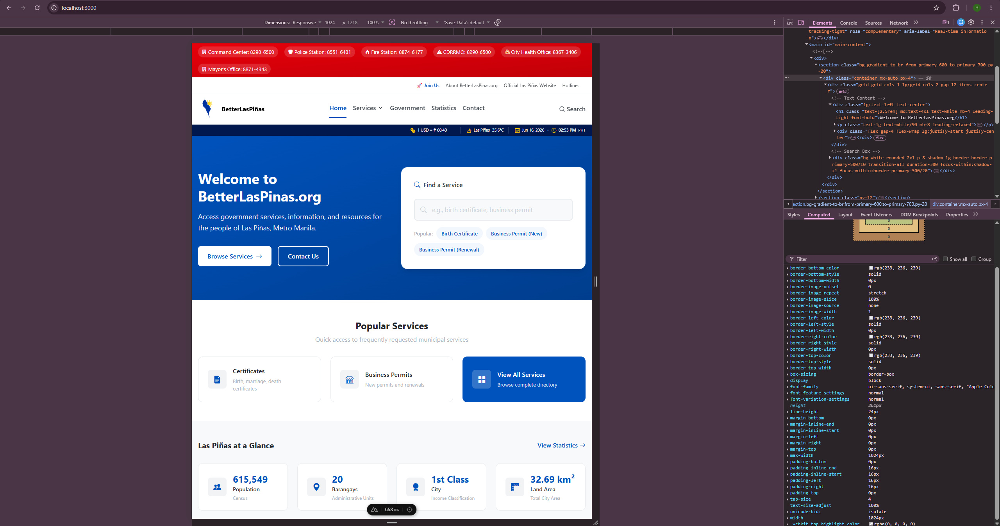

# Contribution [#116]: Fix: Container max-width matching breakpoint removes side margins
 

**Contribution Number:** [1] 
**Student:** [Heidy Gallardo] 
**Issue:** [https://github.com/betterlaspinas/betterlaspinas/issues/116] 
**Status:** [Phase III In Progress]

---

## Why I Chose This Issue

I chose this issue because I want to learn more about frontend development and UI design. This issue affects the application's UI which gives me the opportunity to work on a part of the app that directly affects the user experience across different screen sizes. I am interested in understanding how UI components are structured and maintained in a production-level app.

This issue also aligns with my learning goals of becoming more comfortable working in large, open-source codebases. Through this project, I hope to learn how experienced developers organize frontend code, debug UI-related problems, and test changes before submitting them. Since this issue involves responsive behavior at specific breakpoints, I am also excited to gain hands-on experience troubleshooting layout issues and learning how responsive design is implemented in real-world applications.

---

## Understanding the Issue

### Problem Description

The container loses its horizontal spacing at exact responsive breakpoint widths.

### Expected Behavior

The container should maintain a consistent horizontal gutter from the edges of the viewport at all screen sizes, including when the viewport width exactly matches a breakpoint.

### Current Behavior

At viewport widths of 640px, 768px, 1024px, and 1280px, the container's max-width becomes equal to the viewport width. Since there is no extra horizontal space available, the auto margins become 0, resulting in the content appearing close to the left and right edges of the screen.

### Affected Components

- `main.css`
- `@utility container` definition
- breakpoint-specific container max-width rules
- any page or component that uses the shared container utility

---

## Reproduction Process

### Environment Setup

I first verified that Node.js was installed on my machine. During setup, I discovered that pnpm was not installed. I used Corepack to enable and install pnpm, then confirmed installation.

After completing tool setup, I:

1. Forked and cloned the repository.
2. Created a branch following the project's branch naming guidelines.
3. Installed project dependencies using `pnpm install`
4. Copied the contents of `.env.example` into a local `.env` file.
5. Started the development server using `pnpm dev`.

The main challenge during setup was that pnpm was not installed locally. After enabling and installing it through Corepack, I was able to install dependencies and run the app smoothly.

### Steps to Reproduce

1. Start the app using: `pnpm dev` 
2. Open the app in browser and open Developer Tools
3. Enable Responsive Design Mode.
4. Set the viewport width to 768px (the issue can also be reproduced at 640px, 1024px, and 1280px).
5. Inspect the container element and observe its computed width.
6. Compare the container width to the viewport width.
7. At the affected breakpoint width, the container's max-width matches the viewport width exactly. Since there is no remaining horizontal space, the auto margins become 0, which causes the content to touch the left and right edges of the screen.

### Reproduction Evidence

- **Commit showing reproduction:** N/A (reproduced locally)
- **Screenshots/logs:** 
- **My findings:** I traced the issue to the `@utility container` definition in `main.css`. The container uses `margin-left: auto` and `margin-right: auto` for centering, while the breakpoint-specific `max-width` values are set to the same values as their corresponding media query breakpoints (`640px`, `768px`, `1024px`, and `1280px`). When the viewport width matches one of these values exactly, the container fills the entire viewport width, leaving no remaining space for the auto margins and causing the content to touch the screen edges.

---

## Solution Approach

### Analysis

The issue is caused by the `@utility container` definition in `main.css`. The container uses auto margins for centering, but its max-width values match the breakpoint widths (`640px`, `768px`, `1024px`, and `1280px`).

When the viewport width matches one of these breakpoints exactly, the container fills the entire viewport width, leaving no space for the auto margins. As a result, the content touches the screen edges.

### Proposed Solution

My initial approach is to add horizontal padding to the container so a visible gutter remains even when the container reaches its maximum width.

### Implementation Plan

Using UMPIRE framework (adapted):

**Understand:** The container loses its horizontal spacing at exact breakpoint widhs (640px, 768px, 1024px, and 1280px).

**Match:** The issue is located in the `@utility container` definition in `main.css`:

@media (min-width: 768px) {
  max-width: 768px;
}

The same pattern exists for the other affected breakpoints (`640px`, `1024px`, and `1280px`).

The issue discussion suggests either adding horizontal padding to the container or reducing the breakpoint max-width values.

**Plan:** [Step-by-step implementation plan]
1. Review the existing layout and spacing conventions used throughout the project.
2. Update the `@utility container` implementation in `main.css`.
3. Add horizontal spacing to the container so content does not touch the viewport edges at exact breakpoint widths.
4. Keep the change focused only on the container utility.
5. Verify that the change works across all affected breakpoints.

**Implement:** [Link to your branch/commits as you work]
Branch: [fix/container-side-margins](https://github.com/heidygallardo/betterlaspinas/tree/fix/container-side-margins) 

**Review:** [Self-review checklist - does it follow the project's contribution guidelines?]

Self-review checklist before submitting changes: 

- [ ] Keep the change limited to the container spacing issue.
- [ ] Review my diff for unintended layout changes.
- [ ] Use a descriptive commit message.
- [ ] Open a pull request against the main branch. 

**Evaluate:** [How will you verify it works?]

I will verify the fix by testing the container at: 

- 640px
- 768px
- 1024px
- 1280px 

I will also test nearby viewport widths to ensure the responsive layout still behaves correctly.

Since the contribution guidelines require bug fixes to include regression tests when appropriate, I will check whether the repository has an existing pattern for testing layout-related behavior. I will also run the project's existing test suite:

`pnpm test --run`

The fix will be successful if the container maintains visible horizontal spacing at the affected breakpoints and all existing tests continue to pass.

---

## Testing Strategy

### Unit Tests

- [ ] Test case 1: [Description]
- [ ] Test case 2: [Description]
- [ ] Test case 3: [Description]

### Integration Tests

- [ ] Integration scenario 1
- [ ] Integration scenario 2

### Manual Testing

[What you tested manually and results]

---

## Implementation Notes

### Week 4 Progress

[What you built this week, challenges faced, decisions made]
During Week 3 I looked at test files to check if UI CSS-specific changes have existing tests. After looking at test files and leveraging AI to find any test files that cover CSS changes. 

Challenge Faced
During this week, a challenge I faced was that one existing test was failing, and it was unrelated to the CSS changes I made to fix the bug. The root cause was an existing shebang: #!/usr/bin/env node located in the sripts/validate-config.mjs files. A shebang is only valid when a file is execued by the OS/Node (which strips it before compiling). When Vitest imports the file as a module, the leading # is invalid JavaScript, causing the error mesage "Invalid or unexpected token" to appear. 

How I overcame the Challenge
To solve this, I followed the following steps:
1. Stop Git from forcing CRLF on checkout (config only - touches no files)
2. Stashed only the uncommitted CSS work so the branch update didn't disturb it.
3. Fast-forwarded the local branch to the synced main
4. Forced a fresh checkout of the broken file so it lands as LF.
5. Restored teh CSS work on top of the updated code.
6. Staged and commit
7. Re-ran the existing tests

### Week [Y] Progress

[Continue documenting as you work]

### Code Changes

- **Files modified:** [List]
- **Key commits:** [Links to important commits]
- **Approach decisions:** [Why you chose certain approaches]

---

## Pull Request

**PR Link:** [GitHub PR URL when submitted]

**PR Description:** [Draft or final PR description - much of the content above can be adapted]

**Maintainer Feedback:**
- [Date]: [Summary of feedback received]
- [Date]: [How you addressed it]

**Status:** [Awaiting review / Iterating / Approved / Merged]

---

## Learnings & Reflections

### Technical Skills Gained

[What you learned technically]

### Challenges Overcome

[What was hard and how you solved it]

### What I'd Do Differently Next Time

[Reflection on your process]

---

## Resources Used

- [Link to helpful documentation]
- [Tutorial or Stack Overflow post that helped]
- [GitHub issues or discussions that helped]
